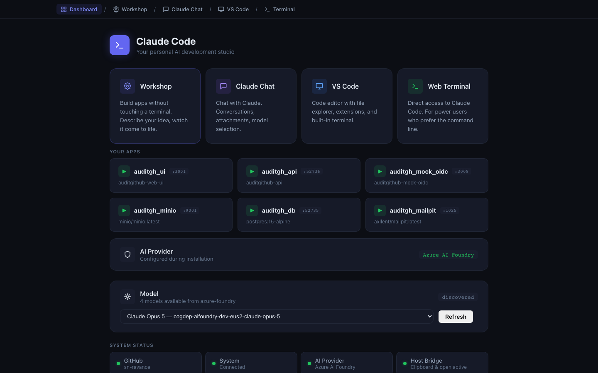

# Dashboard

**Address:** `http://localhost:3000`

The Dashboard is CCDW's front door. It is where you land when you double-click
the desktop shortcut, and it answers one question above all others: **is
everything working?**

---

## What it is for

Three jobs:

1. **Confirm health.** Green dots mean the assistant, the file access, and the AI
   provider are all live. If something is wrong, this page says so in plain
   English before you waste time somewhere else.
2. **Get somewhere.** Four large cards link to Workshop, Claude Chat, VS Code,
   and the Terminal.
3. **Reach the apps you have built.** Anything you built in Workshop and left
   running shows up here with a link.

You will not do work on this page. You will pass through it constantly.

---

## Reading the page, top to bottom

### The startup screen

For the first few seconds after launch you see a dark screen with a checklist:
`AI Provider`, `VS Code`, `Workshop`, `Claude Chat`, `Web Terminal`, `Ready`.
This is CCDW starting its services. It disappears on its own. If it hangs on one
item for more than a minute or two, see **Troubleshooting**.

### Sign-in banner

If your AI provider needs you to log in, a yellow-ish banner appears at the top
with a short code and an **Open Sign-in Page** button. Click the code to copy it,
click the button to open the sign-in page, paste, and approve. The banner
disappears by itself when the sign-in completes.

This banner is the single most common reason the other pages are not working. If
Workshop says "AI provider not configured," come here first.

### The four service cards

| Card | Goes to | Blurb |
|---|---|---|
| **Workshop** | `:9200` | Build apps without touching a terminal |
| **Claude Chat** | `:3002` | Chat with Claude — conversations, attachments, model selection |
| **VS Code** | `:8080` | Code editor with file explorer, extensions, built-in terminal |
| **Web Terminal** | `:7681` | Direct access to Claude Code, for people who prefer the command line |

Workshop is visually highlighted because it is the recommended starting point for
most people.

### Your Apps

Below the cards is a grid of the applications you have built and left running.
Each tile shows the app's name, the port it is on, and the underlying component.
Click one to open it.

These are real, running programs on your machine. They keep running until you
stop them, including after you close your browser.

> **Why does an app I built show several tiles?** A real application often has
> several moving parts — a web page, a database, a file store. Workshop builds
> them as separate pieces so each can be restarted independently. Each piece gets
> its own tile.

### AI Provider

A single row confirming which provider you are configured against — Azure AI
Foundry, AWS Bedrock, or Anthropic. This is set during installation.

### Model

Shows which Claude model CCDW is using, with a **Refresh** button. Click Refresh
after signing in to re-check which models your provider actually offers. If the
list looks wrong or empty, that is usually a sign your sign-in expired.

### System Status

Small indicator tiles along the bottom:

| Tile | What green means |
|---|---|
| **GitHub** | You are signed in to GitHub, so Claude can work with repositories |
| **System** | The container is healthy |
| **AI Provider** | Your provider is reachable and your credentials are valid |
| **Host Bridge** | Copy/paste and "open in Finder" work between the container and your Mac |

---

## How to use it

**Every morning, or after any restart:** open the Dashboard first. Glance at the
green dots. If they are all green, go do your work. If not, deal with it now
rather than being confused later.

**When something is not working elsewhere:** come back here. The Dashboard names
the actual problem, whereas other pages tend to show a generic error.

**When you want to show someone what you built:** the Your Apps grid is the
fastest path — click and it opens.

---

## When to use it

- Right after launching CCDW.
- Any time a different page misbehaves.
- To find and open an app you built earlier.
- To confirm your sign-in is still valid before starting something long.

---

## Common questions

**Nothing loads at `localhost:3000`.**
The container is not running. Double-click the desktop shortcut, wait a minute,
and try again. If it still fails, see **Troubleshooting**.

**A dot is red or amber.**
Hover or read the text under it — it names the problem. The most common by far is
an expired provider sign-in, which is fixed by signing in again.

**Your Apps is empty.**
You have not built anything yet, or what you built is not currently running.
Neither is a problem.

**Can I close this tab?**
Yes. The Dashboard is just a web page — closing it does not stop anything. CCDW
keeps running until you quit it.

---

## Related pages

- **Getting Started** — installation and first sign-in.
- **Workshop** — the card most people click next.
- **Troubleshooting** — what to do when a dot is not green.
