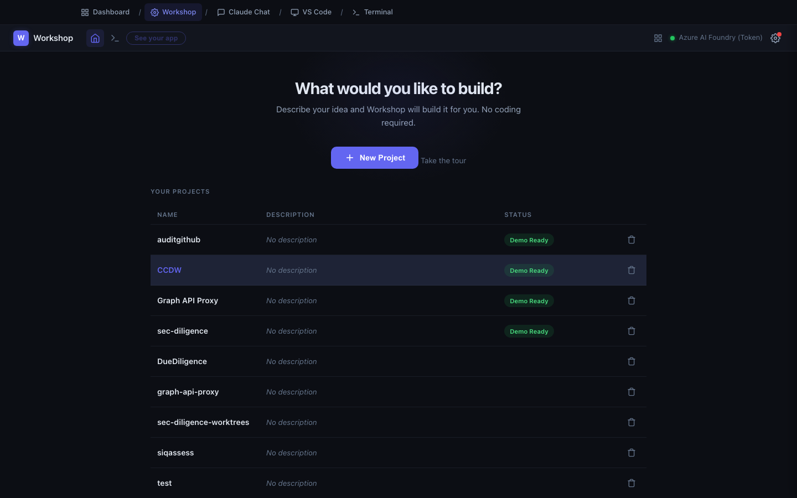
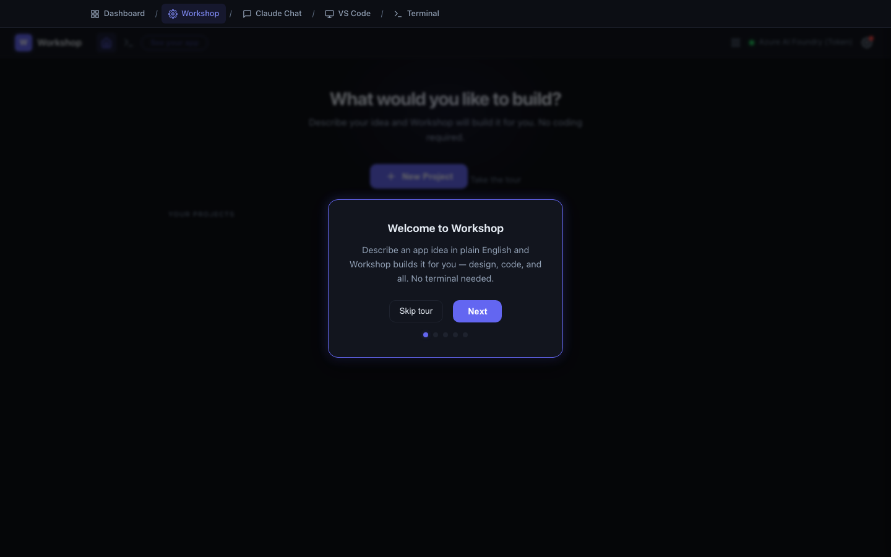

# Workshop

**Address:** `http://localhost:9200`

Workshop turns a description into a working application. You type what you want.
It designs it, writes the code, runs it, and gives you a link to open. No
terminal, no code, no setup.

This is the page that makes CCDW worth installing for most non-technical users.

> **What Workshop actually is.** It is a front end for two built-in skills from
> the **make-it framework**: `/make-it` for a new project, `/resume-it` for one
> that already exists. Workshop picks between them by looking at the folder, then
> runs the whole procedure for you. You never type a command. Worth knowing
> because it explains both the build time and the quality floor — see
> **The make-it Framework**.

---

## What it is for

Building something that does not exist yet.

That covers a lot of ground: internal dashboards, form-and-database tools, data
cleanup utilities, calculators, prototypes for a review, scrapers, report
generators, "I need a page that does X" one-offs.

The output is a real application — real code in a real folder, running as a real
program you can open in a browser and show to someone.

---

## Why you would use it instead of asking an engineer

Not because engineers are unnecessary. Because most ideas die in the queue.

The gap Workshop fills is the one between "I have an idea" and "someone has time
to scope it." In that gap, ideas go stale, requirements get guessed at, and
people build the wrong thing carefully. Workshop lets you skip to a working
version in an afternoon, look at it, and discover what you actually wanted.

Sometimes the working version is enough and nobody else needs to be involved.
Sometimes it becomes the world's clearest spec.

---

## The screen

### Top bar

| Control | What it does |
|---|---|
| **Workshop** logo / home icon | Back to the project list |
| Terminal icon | Opens a command-line view for the current project (optional) |
| **See your app** | Opens your running app in a new tab — greyed out until the app is running |
| Provider indicator (right) | Which AI provider you are on, and whether it is healthy |
| Gear icon | Settings |

### Main area

- **"What would you like to build?"** with a **+ New Project** button.
- **Take the tour** — a five-step walkthrough. Worth doing once.
- **Your Projects** — a table of everything you have built, with name,
  description, and status.

### Project statuses

| Status | Meaning |
|---|---|
| **Pending** | Queued, not started |
| **In Progress** | Currently being built or changed |
| **Demo Ready** | Built and runnable — click **See your app** |
| **Done** | Finished work item |

---

## How to use it

### Starting a project

1. Click **+ New Project**.
2. Give it a short name — `returns-tracker`, `q3-report`. Lowercase with hyphens
   works best. You can rename later.
3. Describe what you want, then click **Start Building**.

### Writing a good description

This is the whole skill. Workshop is only as good as what you tell it.

**Describe what it should do, not how to build it.** You are the expert on the
problem; it is the expert on the implementation.

**Weak:**

> A returns dashboard.

**Strong:**

> A single page where I upload a CSV of product returns. Each row has: date,
> store number, product SKU, reason code, dollar amount.
>
> Show me:
> - Total returns this month vs. last month, as a big number with the percent change
> - A bar chart of returns by reason code
> - A table of the top 20 SKUs by return dollars, sortable by any column
> - A store filter at the top that updates everything on the page
>
> I am the only user. It does not need a login.

The strong version specifies inputs, outputs, and scope. It took two minutes to
write and saves an hour of back-and-forth.

**Checklist for a good description:**

- What goes in? (a file, a form, a pasted list, a database)
- What comes out? (a table, a chart, an export, an email)
- Who uses it? (just me, my team of five, the whole department)
- Anything it must *not* do? ("do not send emails," "read-only")
- Any specific look? ("match our brand blue" — optional, it will pick something reasonable)

### While it builds

Workshop shows progress as it works. This takes real time — minutes, sometimes
tens of minutes for something substantial. It is writing, running, and testing
code the whole time.

You can leave the tab. Work continues. Come back when you like.

### Once it is Demo Ready

Click **See your app**. It opens in a new tab, running on your machine.

It will also appear in the **Your Apps** grid on the Dashboard.

### Asking for changes

Open the project and find the **Changes** panel. Click **+ New Request** and
describe the change the same way you described the original:

> The bar chart is too small. Make it full width, and sort the bars largest to
> smallest.

> Add a "Download as Excel" button above the table.

> The date filter is confusing. Replace it with three buttons: This Month, Last
> Month, Year to Date.

Each request is tracked, so you have a history of how the app evolved.

### Deleting a project

The trash icon on the project row. It asks for confirmation, and the deletion is
permanent — the project folder is removed.

---

## When to use it

**Use Workshop when:**

- The result is something people will *open and use*.
- You would otherwise write a spec and wait.
- You want to test whether an idea is any good before investing in it.
- The task is repetitive and a tool would eliminate it.

**Use something else when:**

- You just want an answer or a summary → **Claude Chat**
- You want to change files in a project that already exists → **Claude Chat**
- You want to inspect what was built → **VS Code**

---

## Tips

**Start smaller than you think.** Get a rough version working, then add. A
sprawling first description produces something sprawling and hard to correct.

**Be specific about data.** If your CSV has particular column names, say so. If
dates are `DD/MM/YYYY`, say so. Guessed assumptions are the top cause of
"that's not what I meant."

**Read what it built.** Open **VS Code** and look at the files. You do not need
to understand every line. Noticing "there are only three files here" or "it
created a database" builds intuition fast.

**One project per idea.** Do not bolt an unrelated feature onto an existing
project. Start a new one — they are cheap.

**Keep the good ones.** Projects live in your `Documents` folder as ordinary
folders. Back them up like anything else.

---

## Limits and cautions

**It is not reviewed code.** Workshop output has not been through security
review, code review, or QA. It is fine for personal and small-team internal use.
Before it touches customer data, money, or anything public, get an engineer to
look at it. This is not a formality.

**It runs on your machine only.** An app built in Workshop is reachable at
`localhost` on your computer. Colleagues cannot open it. Sharing it with others
is a deployment question — talk to your platform team.

**Sensitive data.** Your description and any files it reads are sent to your AI
provider. Confirm with your security team what categories of data are approved
before pointing it at anything regulated.

**It can be wrong.** It will occasionally build something that looks right and
behaves subtly wrong. Test with data where you already know the answer.

---

## Common questions

**How long does a build take?**
A simple page, a few minutes. Something with a database and several screens, well
over half an hour. There is no fixed answer — it is writing real software.

**Can I stop a build?**
Yes, and you can start a new request afterward.

**Where do the files live?**
In a folder under your `Documents`, named after the project. Open it in Finder or
File Explorer like anything else.

**"AI provider not configured" appears at the top.**
Your sign-in expired. Go to the **Dashboard** and sign in again, or type `login`
in the **Terminal** page. Then reload Workshop.

**Can two people work in the same Workshop?**
No. Each person runs their own CCDW on their own machine.

---

## Related pages

- **Claude Chat** — the conversational alternative, for existing files.
- **VS Code** — look at what Workshop built.
- **Dashboard** — find and open apps you built earlier.
- **The make-it Framework** — what Workshop is running, and the other skills.
- **What CCDW Remembers** — why a project picks up where you left it.
- **Troubleshooting** — provider errors, builds that stall.
