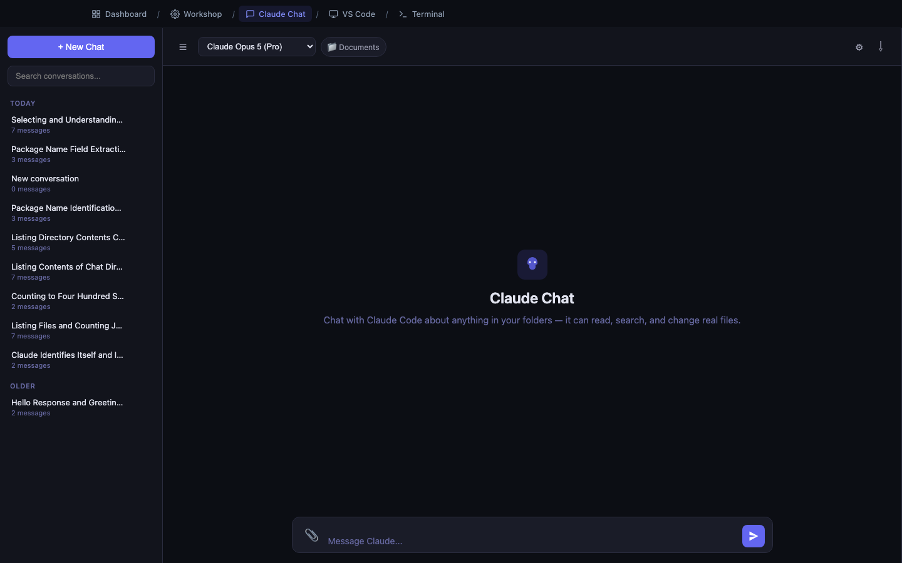
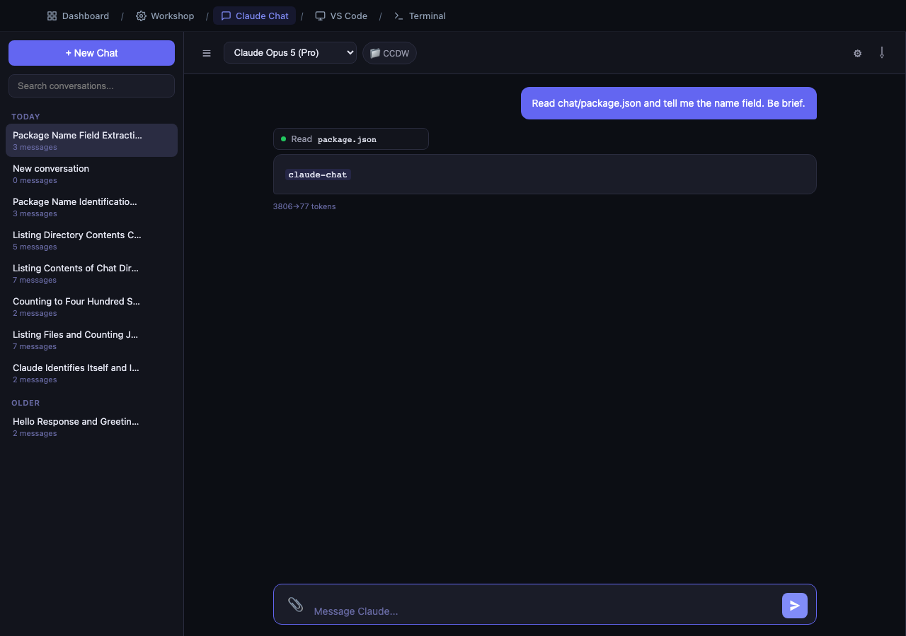
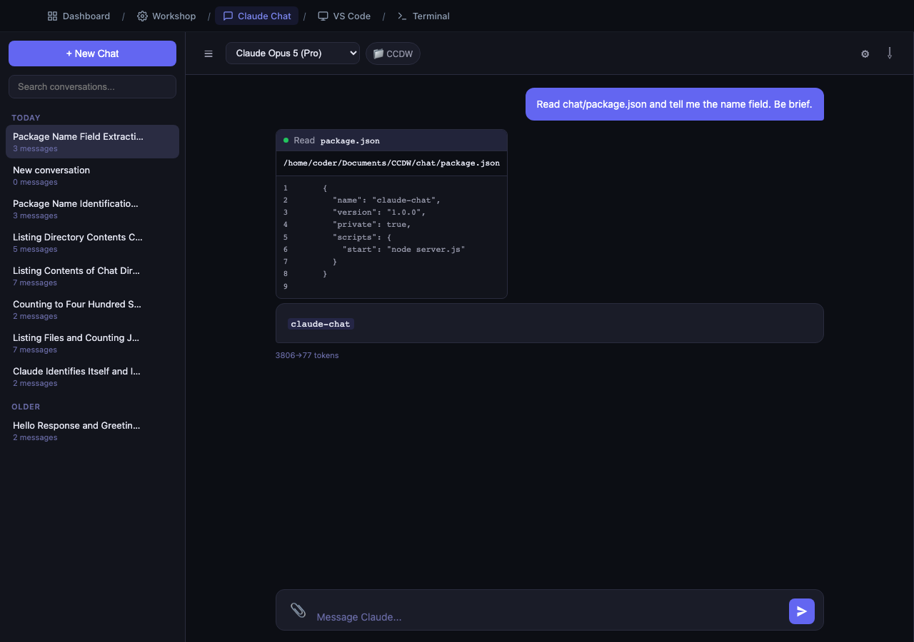

# Claude Chat

**Address:** `http://localhost:3002`

Claude Chat looks like any messaging app you already use — a list of
conversations on the left, a message box at the bottom. The difference is that
this one can actually reach into your folders and do the work.



---

## What it is for

Talking about things that already exist.

Your files, your folders, your projects, your questions. You point a conversation
at a folder, and from then on Claude can read what is in it, search it, run
things in it, and change it — while you stay in a familiar chat interface.

If **Workshop** is "build me a thing," Claude Chat is "let's talk about my
stuff."

---

## Why it exists

People liked Workshop but kept hitting the same wall: Workshop is organized
around *projects*. If you wanted to ask about a folder of spreadsheets, or a
repository someone else wrote, or a directory of contracts, there was nowhere
natural to do it.

Claude Chat is that place. And it is deliberately a chat interface rather than a
terminal, because a chat window is something everyone already knows how to use.
The technical work still happens — you just see it as a quiet footnote instead of
a wall of scrolling text.

---

## The screen

### Left sidebar

- **+ New Chat** — start a fresh conversation.
- **Search conversations** — search across everything you have ever discussed.
- **Conversation list** — grouped by Today / Yesterday / Older. Each shows a
  title (generated automatically from your first message) and a message count.
- Hover a conversation for a **star** (pin to top) and a **trash** (delete).

### Top bar

| Control | What it does |
|---|---|
| Hamburger icon | Show/hide the sidebar |
| **Model dropdown** | Which Claude model to use |
| **Folder chip** (e.g. `Documents`) | Which folder this conversation can see. Click to change. |
| Gear icon | Set a system prompt — standing instructions for new conversations |
| Down-arrow icon | Export the conversation as a Markdown file |
| Stop icon | Appears while Claude is working; stops it |

### Message area

Your messages appear on the right in blue. Claude's replies appear on the left.
Between them you will see small grey **activity chips**.

---

## Activity chips — the important idea

When Claude does real work, it shows up as a small one-line chip:

- `● Read package.json`
- `● Ran ls chat/`
- `● Searched for "invoice"`
- `● Edited report.md`



The dot tells you the state: pulsing blue = working, green = done, red = failed.

**Click a chip to expand it** and see exactly what was run and what came back.
Click again to collapse.



This is deliberate. In a terminal, the scrolling detail *is* the point. In a chat
window it is noise — so it is collapsed by default and available on demand. You
get transparency without clutter.

---

## The folder chip — the most important control

Every conversation is bound to one folder. That folder is what Claude can see.

Click the chip to open the folder picker. You can browse into subfolders, and
folders that are code repositories are marked with a small `git` badge. Click
**Use this folder** to bind the conversation.

**You can browse:**

- `Documents`
- `Desktop`
- `Downloads`
- External drives

**You cannot browse anywhere else.** The picker will not leave those folders,
which is a deliberate safety boundary.

**Changing folders mid-conversation is fine** — the conversation notes the
switch and carries on.

> **Point it at the right folder.** A conversation bound to your whole `Documents`
> folder will be slower and less focused than one bound to the specific project
> folder you care about. Narrow is better.

---

## What Claude can actually do here

The same things a developer using Claude Code can do:

| It can | Example |
|---|---|
| Read files | "Summarize these four contracts" |
| Search | "Which files mention the Q3 forecast?" |
| Write and edit files | "Fix the typos in README.md" |
| Create files | "Turn this into a one-page brief and save it as brief.md" |
| Run commands | "How many rows are in each of these CSVs?" |
| Work across many files | "Rename every mention of Project Falcon to Project Heron" |

**Edits are real and immediate.** There is no preview-and-approve step — this is
configured to act rather than ask. That is what makes it fast, and it is why the
folder boundary matters.

> **Before pointing it at anything you care about, make sure it is backed up or
> in version control.** Claude will do what you ask. If you ask for something
> sweeping, you get something sweeping.

---

## How to use it

### A first conversation

1. Click **+ New Chat**.
2. Click the folder chip and pick a folder with real files in it.
3. Ask something you already know the answer to — a good sanity check:

   > What files are in this folder, and what is the largest one?

4. Watch a chip appear, resolve to green, and an answer arrive.

### Getting good results

**Say what you want, not how.**

> Weak: "Use grep to find the string 'invoice' in the files here."
> Strong: "Which of these documents talk about invoices? Give me a list with a
> one-line summary of each."

**Give it the goal.** "I am preparing for a vendor review on Thursday and need to
know which contracts expire this year" gets you a better answer than "list
contract end dates," because it knows what you are actually going to do with it.

**Ask follow-ups.** It remembers the whole conversation. "Now just the ones over
$50,000" works.

**Correct it plainly.** "No, the amount column is the third one, not the second."
It will redo the work.

### Other controls

**Model dropdown** — heavier models are more capable and slower. The default is
a good choice; change it only if you have a reason.

**System prompt** (gear icon) — standing instructions applied to new
conversations. Useful for things like "Always answer in British English" or
"Assume I am not a developer and explain accordingly."

**Export** (down arrow) — saves the conversation as a Markdown file, good for
pasting into Confluence or email.

**Attachments** (paperclip) — attach images or files directly to a message.

**Stop** — halts Claude mid-work. Anything already done stays done.

---

## For developers: conversations are real Claude Code sessions

Each Claude Chat conversation is a genuine Claude Code session, stored where the
CLI stores its own. You can pick up a browser conversation in the Terminal:

```bash
claude --resume <conversation-id>
```

...and continue it there, then come back to the browser. It is one session, not
two synchronized copies. Non-technical readers can ignore this entirely.

---

## When to use it

**Use Claude Chat when:**

- You have files and questions about them.
- You want to change something that already exists.
- You are exploring and do not know what you want yet.
- You want a searchable record of the conversation.

**Use something else when:**

- You want a runnable app built from scratch → **Workshop**
- You want to read files yourself → **VS Code**
- You are comfortable at a command line and want maximum control → **Terminal**

---

## Common questions

**Does it remember previous conversations?**
It remembers everything within a conversation. It does not automatically recall
other conversations — but they are all in the sidebar and searchable.

**Can I have several conversations about the same folder?**
Yes. That is a good habit — one conversation per topic keeps things focused.

**What happens if I close the tab mid-answer?**
The work stops and the tab's progress is lost. Re-ask. Anything already written
to disk stays written.

**It says the input is disabled / nothing happens when I press Enter.**
A turn is already running in that conversation. Wait for it, or click Stop.

**Why can I not browse to a folder I know exists?**
It is outside the four allowed locations. Move or copy what you need into
`Documents`, `Desktop`, `Downloads`, or an external drive.

**Are my messages private?**
They are sent to your configured AI provider — your organization's Azure AI
Foundry or AWS Bedrock account, or Anthropic directly. Follow your organization's
guidance on what data is approved for that path.

---

## Related pages

- **Workshop** — when you want a built application instead of a conversation.
- **Which Page Should I Use?** — Workshop vs. Chat, side by side.
- **VS Code** — see the files Claude changed.
