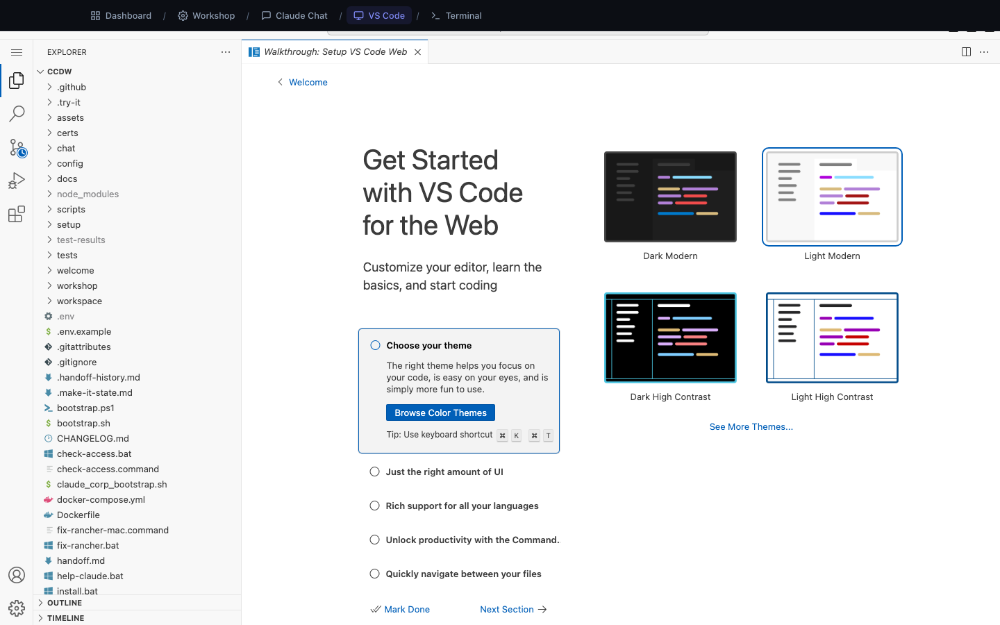

# VS Code

**Address:** `http://localhost:8080`

VS Code is the code editor most professional developers use. CCDW runs a full
copy of it inside your browser, already pointed at your files.



---

## What it is for

Looking at things yourself.

Workshop and Claude Chat do work *for* you. VS Code is where you go when you want
to see the result with your own eyes — read a file, check that a change landed,
make a small manual edit, or just browse the folder structure.

You do not need to know how to code to get value from it. Opening a file and
reading it is a perfectly good use.

---

## Why a non-technical person would open it

**To verify.** Claude Chat says it updated a report. Open the file here and
confirm.

**To understand what Workshop built.** Seeing that your app is four files, not
four hundred, is reassuring and educational.

**To make a one-character fix.** Sometimes asking is slower than clicking into
the file and fixing a typo.

**To browse.** The file explorer on the left is a clearer view of a project than
Finder or File Explorer, because it shows the whole tree at once.

**To learn.** Watching real files change while Claude works is the fastest way to
build intuition about what software actually is.

---

## The screen

### Left rail (icons)

| Icon | What it opens |
|---|---|
| Two pages | **Explorer** — the file tree. The one you will use. |
| Magnifier | **Search** — find text across every file at once |
| Branch | **Source Control** — track changes, if the folder is a repository |
| Play button | **Run and Debug** — for developers |
| Blocks | **Extensions** — add-ons |
| Gear (bottom) | **Settings** |

### Explorer

The file tree. Click a folder to expand, click a file to open it. Files open as
tabs across the top, like browser tabs.

### Editor

The main area. Read-only until you type. Changes save with `Cmd + S` (Mac) or
`Ctrl + S` (Windows).

### Terminal panel

VS Code has a built-in terminal at the bottom, with Claude Code started
automatically when the folder opens. Everything the **Terminal** page can do
works here too, including the built-in `/make-it` skills — handy when you want
the file tree and the assistant side by side. If you do not want it, close it —
nothing breaks.

---

## How to use it

### Reading a file

1. Find it in the Explorer on the left.
2. Click it.
3. Read it.

That is the whole workflow, and it covers most non-technical use.

### Finding something across many files

1. Click the magnifier in the left rail.
2. Type what you are looking for.
3. Results group by file. Click one to jump straight to that line.

This is significantly better than your operating system's search for anything
text-based, and it is a genuinely useful skill to have.

### Making a small edit

1. Open the file.
2. Click where you want to change something and type.
3. Save with `Cmd + S` / `Ctrl + S`.

> **A caution.** In configuration files, punctuation is load-bearing. A missing
> comma or quote can stop a program from starting. Text and documentation are
> safe to edit freely; if a file is full of brackets and colons, prefer asking
> Claude Chat to make the change.

### Opening a specific folder

Add the folder to the address:

```
http://localhost:8080/?folder=/home/coder/Documents/my-project
```

Inside the container, your Mac or PC's `Documents` folder is called
`/home/coder/Documents`.

---

## When to use it

**Use VS Code when:**

- You want to see what changed.
- You want to read a file end to end.
- You need to search text across a whole project.
- You want to make a small, surgical edit.

**Use something else when:**

- You want the change *made for you* → **Claude Chat**
- You want something new built → **Workshop**
- You want to run commands → **Terminal**

---

## Tips

**You cannot break anything by looking.** Opening and reading files changes
nothing.

**Your work is a real folder.** Everything you see here is also visible in Finder
or File Explorer under `Documents`. Two views of the same thing.

**Do not fight the extensions prompt.** VS Code will occasionally suggest
installing an extension. You can always dismiss it.

**A welcome tab may appear on first open.** Close it. It is VS Code's own tour,
not part of CCDW.

---

## Common questions

**Do I need to know how to code?**
No. Reading and searching are useful on their own.

**Is this the real VS Code?**
Yes — the same editor, running in your browser rather than as a desktop app.

**Will my changes conflict with Claude's?**
Save your work before asking Claude to change the same file, and you will be
fine. VS Code reloads files from disk automatically when they change underneath
you.

**It is slow to load.**
The first load builds an in-browser cache and can take 10–20 seconds. Later loads
are quick.

**Can I install extensions?**
Yes, but they live inside the container and may be lost on a major update. Do not
build a workflow that depends on one.

---

## Related pages

- **Claude Chat** — have changes made for you instead.
- **Workshop** — see what your built project actually contains.
- **Terminal** — the command line, if you want to go further.
