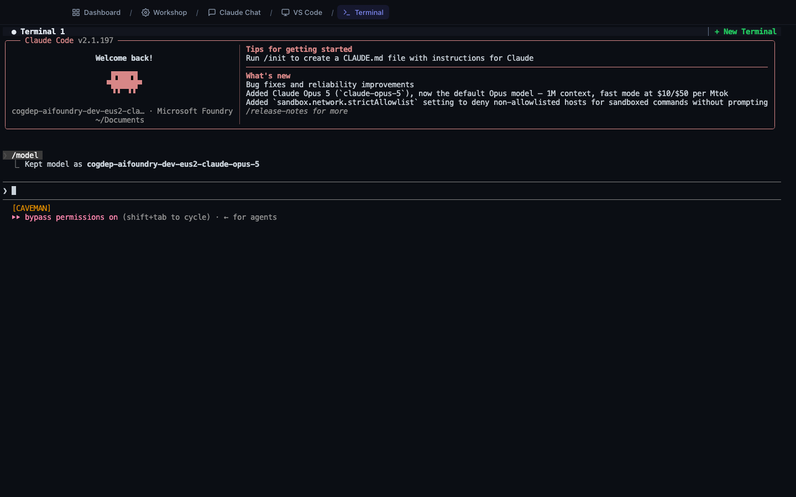

# Terminal

**Address:** `http://localhost:7681`

The Terminal is Claude Code in its original form — a command line, in your
browser. It is the most powerful page in CCDW and the least friendly.



---

## Should you use this page?

**Probably not, at first.** Everything most people need is available in
**Workshop** and **Claude Chat**, in an interface that does not require learning
anything new.

Read this page anyway, for two reasons:

1. **One command here fixes the most common problem in CCDW.** When your sign-in
   expires, typing `login` here is the fix.
2. **It demystifies the rest.** Workshop and Claude Chat are friendly wrappers
   around exactly this. Seeing it once makes the others make more sense.

---

## What it is for

Direct, unmediated access to Claude Code:

- Every capability, with nothing hidden or simplified
- Slash commands (`/model`, `/init`, `/clear`) that the web pages do not expose
- Running ordinary commands yourself
- Signing in and out of your AI provider
- Resuming a conversation started in Claude Chat

---

## The screen

A mostly-black page with:

- A tab bar at the top — **Terminal 1**, and a **+ New Terminal** button
- A welcome panel showing your model, provider, and current folder
- A prompt (`›`) where you type
- A status line at the bottom

You type; you press Enter; text appears. There is nothing to click.

---

## How to use it

### Talking to Claude

Type in plain English and press Enter:

```
What files are in this folder?
```

```
Summarize the CSVs in Downloads and tell me which has the most rows.
```

Same assistant as Claude Chat. Different presentation — here you see every step
as it happens, in full.

### The commands actually worth knowing

| Command | What it does |
|---|---|
| `login` | **Sign in to your AI provider again.** The fix for "provider not configured" and expired-token errors. |
| `/model` | Show or change which Claude model is in use |
| `/clear` | Start a fresh conversation, forgetting the current one |
| `/init` | Create a `CLAUDE.md` file — standing instructions for this folder |
| `/help` | List every available command |
| `exit` | Close the session |

Slash commands start with `/`. Everything else is either plain English for
Claude, or a system command.

### The make-it skills

CCDW also ships fourteen built-in skills, run the same way. The Terminal is the
only page where you can reach all of them.

| Skill | What it does |
|---|---|
| `/make-it` | Build a new app from an idea. This is what Workshop runs for you. |
| `/resume-it` | Pick an existing app back up — features, bugs, tests. |
| `/try-it` | Start the app with stand-in services and test it automatically. |
| `/nemo-it` | Security scan; writes a report, changes nothing. |
| `/fix-it` | Fix what `/nemo-it` found, then re-scan. |
| `/debug-it` | Find a bug's root cause before changing anything. |
| `/git-it` | Commits, branches, and cleanup done properly. |
| `/clear-it` | Checkpoint the session to `handoff.md` before clearing context. |
| `/wrap-it` | End the session cleanly and save progress. |

Five more — `/retrofit-it`, `/argo-it`, `/demo-it`, `/dispatch-it`, and
`/subagent-it` — are aimed at developers and operations. See
**The make-it Framework** for all of them.

Move into the folder first, then run the skill:

```bash
cd Documents/my-project
```

```
/try-it
```

### Moving around

```bash
cd Documents/my-project    # go into a folder
ls                         # list what is here
pwd                        # show where you are
```

Claude works in whatever folder you are standing in, so `cd` first, then ask.

### Resuming a Claude Chat conversation

Conversations from **Claude Chat** are real Claude Code sessions and can be
continued here:

```bash
claude --resume <conversation-id>
```

You can go back to the browser afterward. It is one conversation, not a copy.

---

## Session persistence

The Terminal keeps your session alive even if you close the browser. Reopen
`localhost:7681` and you are back where you were, mid-conversation, with your
scroll history.

This is unusual and genuinely useful. It means a long-running task survives your
laptop lid closing.

**+ New Terminal** opens a second independent session, if you want one thing
running while you do something else.

---

## When to use it

**Use the Terminal when:**

- You need to sign in again (`login`).
- You want a slash command the web pages do not offer.
- You are a developer and this is simply how you work.
- Something is broken and you want to see the raw error.

**Use something else when:**

- You want to build an app → **Workshop**
- You want to talk about files comfortably → **Claude Chat**
- You want to read or edit a file → **VS Code**

---

## Tips for people who do not live in a terminal

**Nothing you type here can hurt your computer outside the allowed folders.** The
container can only reach `Documents`, `Desktop`, `Downloads`, and external
drives.

**Files can still be changed or deleted inside those folders.** The boundary
limits *reach*, not *consequence*. Have backups.

**Ctrl + C stops whatever is running.** If something is stuck or you changed your
mind, that is the escape hatch.

**The up-arrow key recalls what you typed before.** Faster than retyping.

**You cannot get lost.** `pwd` tells you where you are. `cd ~` returns you home.

**Copy and paste work normally** — `Cmd + C` / `Cmd + V` on Mac, `Ctrl + Shift + C`
/ `Ctrl + Shift + V` on Windows.

---

## Common questions

**I typed something and nothing happened.**
Claude may be thinking. Give it a moment. If it is truly stuck, `Ctrl + C`.

**The text is tiny.**
Zoom the browser: `Cmd +` / `Ctrl +`.

**I get "command not found."**
You typed a system command that does not exist. If you meant to ask Claude
something, just write it as a sentence — no command needed.

**How do I start over?**
`/clear` forgets the current conversation and starts fresh.

**Is this the same Claude as the other pages?**
Yes. Same assistant, same model, same access. Only the presentation differs.

---

## Related pages

- **Claude Chat** — the same capability with a friendlier face.
- **The make-it Framework** — every skill listed above, in detail.
- **What CCDW Remembers** — why your session and settings are still here.
- **Troubleshooting** — where `login` is the answer to several problems.
- **Glossary** — for the terminal vocabulary on this page.
